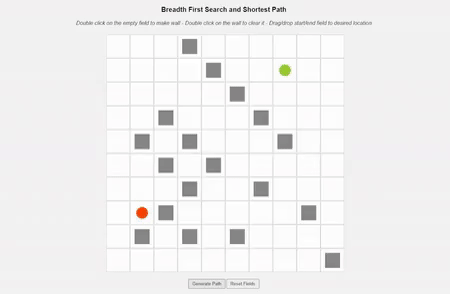

# Breadth first search and shortest path algorithm
 
 
Hello, this is a small project created with newly aquired skills about basic searching algorithms. 
Few images and one gif file below.
 
 
Recently, while I was trying to complete <a href="https://github.com/IvanMPR/Lines" target="_blank">Lines game</a>,
I hit a wall when the shortest path algorithm should be implemented. So, after quite of a research and investigating, I was
able to understand what is neccessary for that project to be completed. This app can be considered as a middle step towards the 
final goal of having fully funcitonal Lines game.
 
 

 
